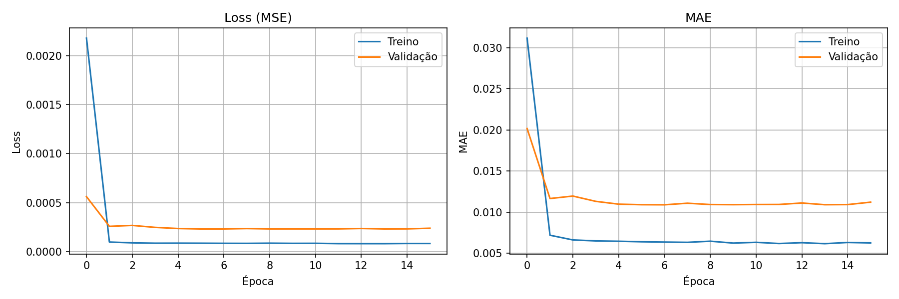
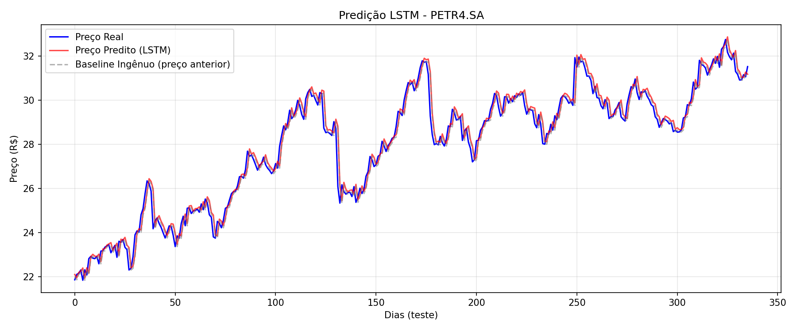

# Tech Challenge - Predição de Ações com LSTM

## 🚀 API em Produção

A API está deployada no **Render** (containerizada via Docker) e disponível publicamente:

| | URL |
|---|---|
| **Base** | https://lstm-petr4-api.onrender.com |
| **Documentação (Swagger)** | https://lstm-petr4-api.onrender.com/docs |
| **Health Check** | https://lstm-petr4-api.onrender.com/health |
| **Predição (POST)** | https://lstm-petr4-api.onrender.com/predict |
| **Histórico (GET)** | https://lstm-petr4-api.onrender.com/historico |
| **Métricas (GET)** | https://lstm-petr4-api.onrender.com/metricas |

> O plano gratuito do Render hiberna após 15 min de inatividade. A primeira requisição após esse período pode levar ~50 segundos para responder.

---

## 🎥 Vídeo de Demonstração

https://github.com/user-attachments/assets/976ac4ec-f6be-458d-b3e5-0b31ac6b1101

---

## Descrição
Modelo de deep learning **LSTM (Long Short-Term Memory)** para prever o preço de fechamento das ações da **Petrobras (PETR4.SA)**, com deploy em API REST via FastAPI containerizada com Docker no serviço de nuvem **Render**.

## Estrutura do Projeto

```
mlet_4/
├── data_pipeline.py     # Coleta e pré-processamento dos dados
├── modelo_lstm.py       # Arquitetura e treinamento do modelo LSTM
├── train.py             # Script principal de treinamento
├── api.py               # API FastAPI para predições
├── requirements.txt     # Dependências do projeto
├── .gitignore
├── README.md
├── models/              # (gerado) Artefatos do modelo
│   ├── lstm_model.pth
│   ├── scaler.pkl
│   ├── config.json
│   └── metricas.json
└── data/                # (gerado) Dados e gráficos
    ├── PETR4.SA_historico.csv
    ├── treinamento_historico.png
    └── predicoes_vs_real.png
```

## Requisitos

- Python 3.10+
- PyTorch
- Conexão com internet (para coleta de dados via Yahoo Finance)

## Instalação

```bash
# Criar e ativar ambiente virtual
python -m venv venv
venv\Scripts\activate  # Windows
# source venv/bin/activate  # Linux/Mac

# Instalar dependências
pip install -r requirements.txt
```

## Execução

### 1. Treinar o Modelo

```bash
python train.py
```

Este comando executa toda a pipeline:
1. Coleta dados da Petrobras (PETR4.SA) via Yahoo Finance (2018-2024)
2. Pré-processa e normaliza os dados com MinMaxScaler
3. Cria sequências temporais (janela de 60 dias)
4. Treina modelo LSTM com 2 camadas (50 neurônios) e early stopping
5. Avalia o modelo com métricas MAE, RMSE, MAPE, R², **comparação com baseline ingênuo** e **acurácia direcional**
6. Salva modelo treinado e gráficos (curva de loss e predições vs. real vs. baseline)

### 2. Iniciar a API

```bash
python -m uvicorn api:app --reload --host 0.0.0.0 --port 8000
```

A API estará disponível em: http://localhost:8000

Documentação interativa (Swagger): http://localhost:8000/docs

## Endpoints da API

Base URL produção: `https://lstm-petr4-api.onrender.com`

| Método | Endpoint      | Descrição                              |
|--------|--------------|----------------------------------------|
| GET    | `/`          | Informações gerais da API              |
| GET    | `/health`    | Status e informações do modelo         |
| POST   | `/predict`   | Realizar predição de preço             |
| GET    | `/historico` | Últimos N dias de preços históricos    |
| GET    | `/metricas`  | Métricas de avaliação do modelo        |
| GET    | `/metrics`   | Métricas Prometheus (latência, contagem de requests, tamanho de payload) |
| GET    | `/system-metrics` | Uso de CPU/memória/threads e uptime do processo da API |

### Exemplo de Predição (busca automática via Yahoo Finance)

```bash
curl -X POST "https://lstm-petr4-api.onrender.com/predict" \
  -H "Content-Type: application/json" \
  -d '{"symbol": "PETR4.SA", "dias_futuros": 5}'
```

### Exemplo com preços históricos fornecidos pelo usuário

O campo `precos_historicos` aceita uma lista de preços de fechamento (do mais antigo ao mais recente). Deve conter ao menos 60 valores.

```bash
curl -X POST "https://lstm-petr4-api.onrender.com/predict" \
  -H "Content-Type: application/json" \
  -d '{"symbol": "PETR4.SA", "dias_futuros": 3, "precos_historicos": [35.1, 35.2, ..., 39.8]}'
```

**Resposta:**
```json
{
  "symbol": "PETR4.SA",
  "data_referencia": "2024-12-30",
  "predicoes": [
    {"dia": 1, "data_estimada": "2024-12-31", "preco_previsto": 36.85},
    {"dia": 2, "data_estimada": "2025-01-02", "preco_previsto": 36.92}
  ],
  "modelo_info": {"MAE": 0.33, "RMSE": 0.45, "MAPE": 1.18, "R2": 0.97, "Acuracia_Direcional": 52.08}
}
```

## Arquitetura do Modelo

```
ModeloLSTM(
  (lstm): LSTM(1, 50, num_layers=2, batch_first=True, dropout=0.2)
  (fc): Linear(in_features=50, out_features=1, bias=True)
)
Total params: 31,051
```

- **Input**: 60 dias de preços normalizados
- **Output**: preço de fechamento do dia seguinte, calculado como `último_preço_conhecido + ajuste_aprendido_pela_lstm` (conexão residual)
- **Otimizador**: Adam (lr=0.001)
- **Loss**: Mean Squared Error
- **Regularização**: Dropout 20% entre camadas LSTM
- **Early Stopping**: patience=10 épocas

### Por que conexão residual?

Preços de ações no horizonte de 1 dia se comportam quase como um *random walk*: o preço de amanhã é estatisticamente muito próximo do de hoje. Por isso, métricas como R² e MAPE sozinhas enganam — um **baseline ingênuo** ("preço de amanhã = preço de hoje") já atinge R² ≈ 0.97 só pela autocorrelação da série.

Na primeira versão do modelo (sem a conexão residual), o LSTM previa o preço absoluto e tinha que reaprender esse nível do zero, ficando **pior que o baseline ingênuo** (RMSE 1.62 vs. 0.45, R² 0.64, acurácia direcional 49.7% — ou seja, chute). Ao mudar a saída da rede para prever apenas o **ajuste sobre o último preço conhecido**, o modelo passou a empatar com o baseline em erro de preço e a superar discretamente o acaso na direção do movimento:

| Métrica | Antes (sem residual) | Depois (com residual) | Baseline ingênuo |
|---|---|---|---|
| RMSE | R$ 1.62 | **R$ 0.45** | R$ 0.45 |
| R² | 0.64 | **0.971** | 0.972 |
| MAPE | 4.73% | **1.18%** | 1.16% |
| Acurácia direcional | 49.7% (chute) | **52.1%** | — |

## Avaliação do Modelo

Além das métricas tradicionais (MAE, RMSE, MAPE, R²), o `train.py` calcula automaticamente:

- **Baseline ingênuo**: métricas de simplesmente repetir o último preço conhecido, usado como referência mínima de qualidade.
- **Acurácia direcional**: % de dias em que o modelo acerta se o preço vai subir ou descer em relação ao dia anterior (50% = equivalente a um chute).

Gráficos gerados em `data/` após rodar `train.py`:

**Curva de treino (loss e MAE por época):**



**Preço real vs. predição do modelo vs. baseline ingênuo (conjunto de teste):**



## Tecnologias Utilizadas

- **Python** - Linguagem principal
- **PyTorch** - Framework de Deep Learning
- **yfinance** - Coleta de dados financeiros
- **scikit-learn** - Normalização e métricas
- **FastAPI** - Framework para API REST
- **Pandas/NumPy** - Manipulação de dados
- **Matplotlib** - Visualizações
- **Docker** - Containerização da aplicação
- **Render** - Plataforma de cloud deploy (container)

## Monitoramento

A API expõe instrumentação de observabilidade para acompanhar performance em produção:

- **`GET /metrics`**: métricas no formato Prometheus (via `prometheus-fastapi-instrumentator`), incluindo latência por endpoint (histograma), contagem total de requisições por status/handler e tamanho de payloads. Pode ser coletado por um Prometheus e visualizado em Grafana.
- **`GET /system-metrics`**: uso de CPU, memória (RSS/VMS), número de threads e uptime do processo, via `psutil`.
- **Logging estruturado**: um middleware HTTP loga método, rota, status code e tempo de resposta (ms) de cada requisição, e adiciona o header `X-Process-Time-Ms` na resposta.
